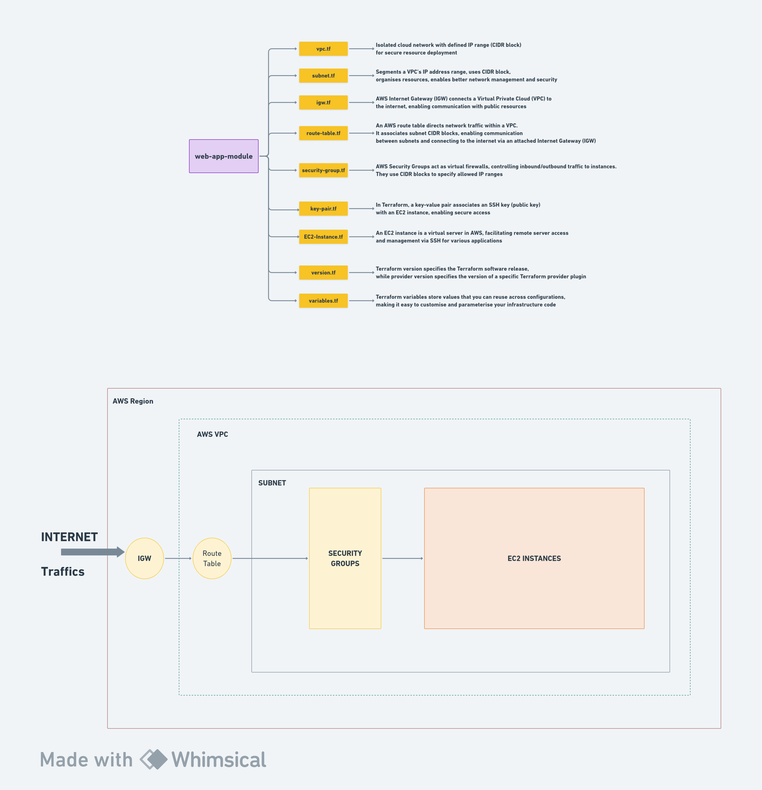

# Web App Terraform Deployment

Welcome to the Web App Terraform project! This guide will walk you through deploying a simple web application on AWS using Terraform. Follow the steps below to set up your infrastructure.
## Project Overview Through a Diagram


## Prerequisites

Before you begin, make sure you have the following installed:

- [Terraform](https://www.terraform.io/downloads.html)
- [AWS CLI](https://aws.amazon.com/cli/)

Ensure your AWS credentials are configured using `aws configure`.

## Getting Started

1. **Clone the Repository:**

    ```bash
    git clone https://github.com/panchanandevops/Learning-Terraform.git
    cd Learning-Terraform
    ```

2. **Navigate to the Module:**

    ```bash
    cd web-app-module
    ```

3. **Customize Variables (Optional):**

    Open the `variables.tf` file to customize variables according to your preferences. This step is optional, as default values are provided.

4. **Initialize Terraform:**

    ```bash
    terraform init
    ```

5. **Review and Apply Changes:**

    ```bash
    terraform apply
    ```

    Review the planned changes, and if everything looks good, type `yes` to apply the changes.

6. **Access Your Web Application:**

    After deployment, find the public IP of the EC2 instance in the Terraform output. Use this IP to access your web application.

7. **Clean Up (Optional):**

    If you want to remove the resources, run:

    ```bash
    terraform destroy
    ```

    Type `yes` to confirm deletion.

## Important Notes

- **Security:** Keep your AWS credentials secure. Avoid sharing sensitive information.

- **Cost Management:** Be aware of AWS costs associated with the resources created. Always clean up resources when they are no longer needed.

## Additional Details

For additional details on variables and configurations, refer to the `variables.tf` file. Feel free to explore and modify as needed.

Happy Terraforming!