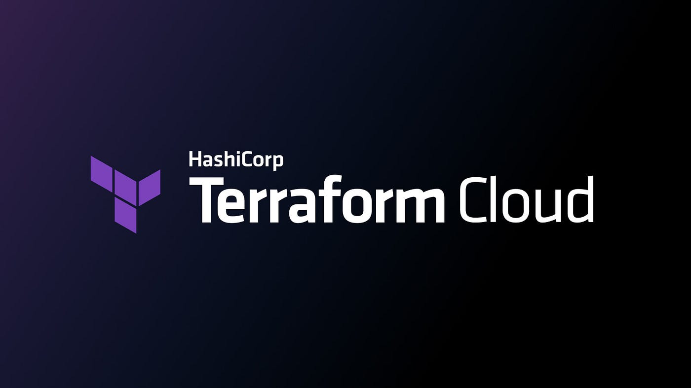
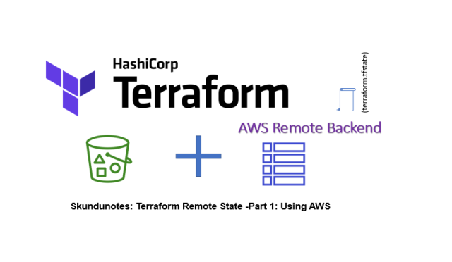

# Management of Terraform Statefiles
---
  

## Terraform Statefiles:

*   The state file is structured as a JSON file and serves as a repository of information pertaining to resources and data objects provisioned through Terraform.
*   It includes crucial metadata associated with each resource, offering insights into their type, configuration, and other essential details.
*   Because the state file might have sensitive data, it needs strong protection like encryption to keep the stored information safe and private.

here is an example of a **.tfstate** file for a terraform config managing an S3 bucket:

  

```hcl
  {
  "version": 4,
  "terraform_version": "1.0.0",
  "serial": 1,
  "lineage": "your-lineage-here",
  "outputs": {},
  "resources": [
    {
      "mode": "managed",
      "type": "aws_s3_bucket",
      "name": "example_bucket",
      "provider": "provider.aws",
      "instances": [
        {
          "attributes": {
            "acl": "private",
            "bucket": "example-bucket",
            "force_destroy": false,
            "id": "example_bucket",
            "region": "us-east-1",
            "tags": {}
          },
          "private": "bnVsbA=="
        }
      ]
    }
  ]
}
```

  

There are two ways to store a statefile

1. **Local Backend:** The state file resides in the project's working directory for easy access and management.
2. **Remote Backend:** The state file is kept securely in a remote storage, like Terraform Cloud, ensuring centralized and safe storage.

  

## **Drawbacks of Local Backend**

*   Stores sensitive information as plain text
*   Not ideal for collaboration
*   Limited version control capabilities
*   lack of backup storage
*   Involves manual steps for applying changes

  

## Advantages of Remote Backend:

*   Enhanced security for sensitive information.
*   Facilitates collaborative work with multiple users.
*   Streamlines workflows through CI/CD.
*   Supports version control for change tracking.

  

Two options for employing a remote backend include:

1. **Terraform Cloud** (managed offering)
2. **Self-managed** remote backends (e.g., Amazon S3, Google Cloud Storage)

  

## Terraform Cloud

*   A managed offering from HashiCorp
*   Specify a backend type of "remote" with organization and workspace names in the Terraform configuration
*   Web UI allows you to interact with your account, organization, and workspaces
*   for more information checkout [https://www.terraform.io/cloud](https://www.terraform.io/cloud)

<div style="text-align:center;">
  
</div>


## **Self-managed Remote Backend**

*   we will use AWS S3 buckets and DynomoDB table in terraform backend configuration.
*   S3 bucket stores the state file, while the DynamoDB table prevents multiple concurrent apply commands.
*   Requires a bootstrapping process to provision the S3 bucket and DynamoDB table.

<div style="text-align:center;">
  
</div>


**Bootstrapping steps for AWS S3 Backend:**
1. Create a Terraform configuration **without a remote backend** (defaults to a *local backend*)
2. Define the necessary AWS resources: S3 bucket and DynamoDB table with a hash key named **"LockID"**
3. Run **terraform apply** to create the S3 bucket and DynamoDB table
4. Update the Terraform configuration to use the remote backend with the S3 bucket and DynamoDB table
5. Re-run **terraform init** to import the state into the new remote backend


```
terraform {
  #############################################################
  ## AFTER RUNNING TERRAFORM APPLY (WITH LOCAL BACKEND)
  ## YOU WILL UNCOMMENT THIS CODE THEN RERUN TERRAFORM INIT
  ## TO SWITCH FROM LOCAL BACKEND TO REMOTE AWS BACKEND
  #############################################################
  # backend "s3" {
  #   bucket         = "Panchanan-devops-tf-state" # REPLACE WITH YOUR BUCKET NAME
  #   key            = "Local/import-bootstrap/terraform.tfstate"
  #   region         = "us-east-1"
  #   dynamodb_table = "terraform-state-locking"
  #   encrypt        = true
  # }

  required_providers {
    aws = {
      source  = "hashicorp/aws"
      version = "~> 3.0"
    }
  }
}

provider "aws" {
  region = "us-east-1"
}

resource "aws_s3_bucket" "terraform_state" {
  bucket        = "Panchanan-Devops-tf-state" # REPLACE WITH YOUR BUCKET NAME
  force_destroy = true
}

resource "aws_s3_bucket_versioning" "terraform_bucket_versioning" {
  bucket = aws_s3_bucket.terraform_state.id
  versioning_configuration {
    status = "Enabled"
  }
}

resource "aws_s3_bucket_server_side_encryption_configuration" "terraform_state_crypto_conf" {
  bucket        = aws_s3_bucket.terraform_state.bucket
  rule {
    apply_server_side_encryption_by_default {
      sse_algorithm = "AES256"
    }
  }
}

resource "aws_dynamodb_table" "terraform_locks" {
  name         = "terraform-state-locking"
  billing_mode = "PAY_PER_REQUEST"
  hash_key     = "LockID"
  attribute {
    name = "LockID"
    type = "S"
  }
}
```


