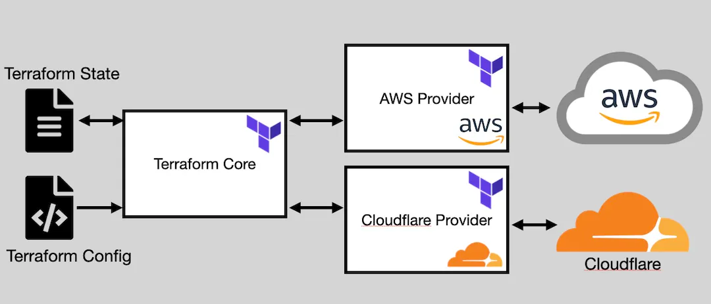

# Infrastructure *as* Code with Terraform


## What is Infrastructure *as* Code?

Infrastructure as Code (IaC) is an approach to managing and provisioning computing infrastructure through machine-readable script files, rather than through physical hardware configuration or interactive configuration tools. The goal of IaC is to automate the process of setting up and managing infrastructure, making it more efficient, repeatable, and less prone to human error.

## What is Terraform?

Terraform is an open-source infrastructure provisioning tool by HashiCorp. It enables users to define and manage infrastructure as code, automating the deployment of resources across cloud providers and on-premises environments. With a declarative configuration language, it ensures consistent and scalable infrastructure deployment, making it a key tool in DevOps practices.

## Prerequisites

1. AWS Account.
2. AWS CLI and configure it with your Terminal.
3. Install Terraform in your machine(URL).

## Terraform Architecture:

  

<div style="text-align:center;">
  
</div>


  

### Terraform Core:

1. The engine that processes configuration files and manages the Terraform state file.
2. Responsible for syncing the current state with desired configurations via cloud provider APIs.

  

### Terraform Providers:

1. Terraform Core plugins enable interaction with distinct cloud providers and services.
2. Map configuration and state info to relevant API calls in Terraform Core plugins.

  

### Terraform Statefiles:

1. **Tracking Infrastructure State:** Terraform Statefiles store information about the current state of deployed infrastructure, tracking resources, configurations, and dependencies.
2. **Concurrency and Collaboration:** Statefiles enable collaboration among team members by managing access to shared infrastructure state. Terraform uses state locking to prevent conflicts and maintain consistency during simultaneous operations.

## The General Sequence of Terraform Commands:

1. **terraform init:** Initializes your project.
2. **terraform plan:** Checks your configuration against the current state and generates a plan.
3. **terraform apply:** Applies the plan to create or update your infrastructure.
4. **terraform destroy:** Removes resources when no longer needed.

Lets understand it through a Basic Terraform Configuration.

  

-  Create a file named main.tf.
-  here is the code add this code to main.tf file.

```hcl
terraform {
  required_providers {
    aws = {
      source  = "hashicorp/aws"
      version = "~> 3.0"
    }
  }
}

provider "aws" {
  region = "us-east-1"
}

resource "aws_instance" "example" {
  ami           = "ami-011899242bb902164" # Ubuntu 20.04 LTS // us-east-1
  instance_type = "t2.micro"
}
```

  

> This basic configuration specifies the AWS provider and an EC2 instance resource using an Ubuntu 20.04 AMI and the t2.micro instance type.


now use terraform commands

1. Initialize Terraform in the directory containing [main.tf](http://main.tf) by running **terraform init**. This sets up the backend and state storage.
2. Run **terraform plan** to view the changes Terraform will make to your infrastructure.
3. Run **terraform apply** to create the specified resources. Confirm the action when prompted.
4. To clean up resources and avoid unnecessary costs, run **terraform destroy** and confirm the action when prompted.

Upon completion of the provisioning process, you can readily observe the EC2 instance in your AWS console.


In the next segment, we'll delve deeper into Terraform concepts with a hands-on exploration through a sample project. **Stay tuned for the learning journey ahead! Take care and see you soon!**